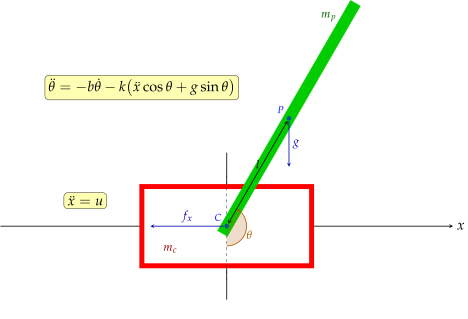

# Overview

CartPole is research project, which is designed to learn the basics of optimal control and reinforcement learning
The environment is a variation of famous control problem, where a pole is attached by a joint to a cart, moving along a axis.
Some motor drives the cart with acceleration as control input.
The goal is to swing up the pole and maintain it in unstable equilibrium state.

