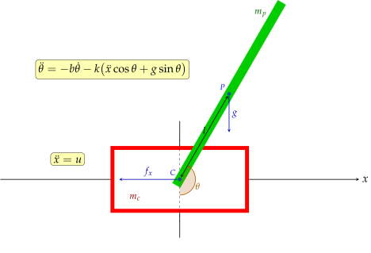

# Overview

CartPole is a personal research project aimed at learning modern reinforcement learning methods applicable to robotics.
The environment is a variation of the classic control problem, where a pole is attached by a joint to a cart that moves along a single axis.
A motor drives the cart, with acceleration serving as the control input.
The objective is to swing up the pole and keep it balanced in the unstable upright position.

In addition to the main goal, the project also addresses several secondary objectives:
- Exploring the JAX framework and its ecosystem
- Building a fully functional device from scratch

